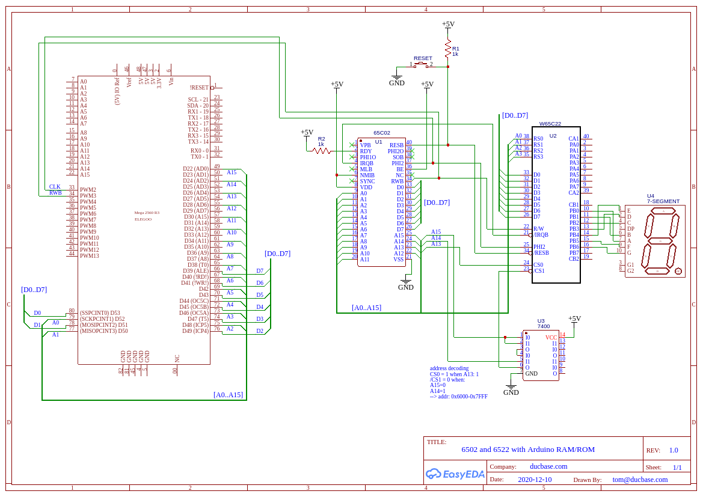

# Arduino Mega based 6502 monitor

Credits: The base for this code comes from Ben Eater's website.  Check out
his video's on the 6502.  That's what got me interested in the first place.
<https://eater.net/6502>

## Features

* Arduino generated clock
* RAM and ROM simulated by Arduino

## Overview

This version of the monitor allows for toying with the 6502 in a minimal setup.
All you need is power to the 6502 and connections to the address and dat bus.

The monitor will provide a clock (on PIN 2), if PIN 4 is held low.  You can 
pause execution if you disconnect PIN 4 from ground.

If you want to get a bit more action going on, you can connect a 6522 VIA to operate some leds.  Below is a schematic of my setup at the time of testing.

